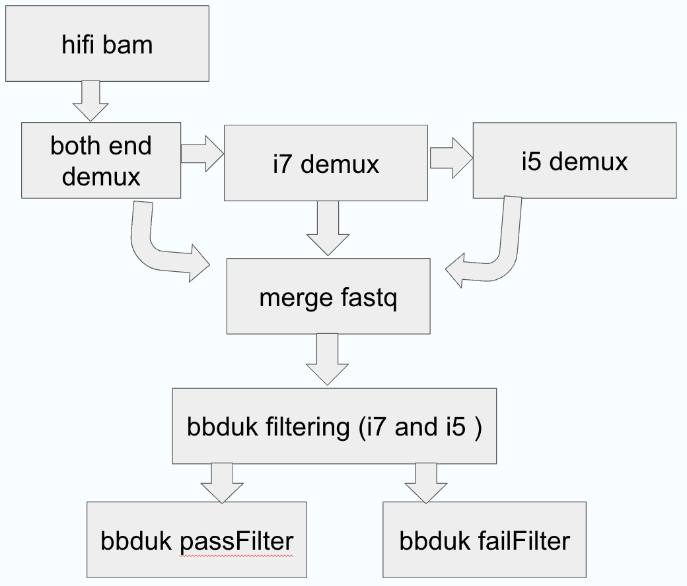

---
output:
  word_document: default
  html_document: default
---

# seqWell longPlex kit demultiplex nextflow pipeline

This is the work flow in nextflow to do demultiplex on pacbio data for seqWell longplex kit. The pipeline uses lima for demultiplex and uses BBDuk for data filtering.  The workflow is as shown in the image below. The workflow starts with hifi bam file, then a two-step lima process is conducted. Each lima process will clip off the corresponding barcode.

 - lima demulitplex using neighbor option, get reads with both i7 and i5 seqWell barcode. Keep unbarcoded reads which goes to the next lima process.
 - lima demultiplex using i7 or i5 barcode on the unbarcoded reads from the previous lima process. 

After the two-step lima process, bam files from these two stpes are merged from each sample and converted to fastq format. BBDuk is used to filter out reads that have extra barcode left on the merged fastq files.
The output from this pipeline has lima output, BBDuk output, and also a demultiplex summary from lima and BBDuk process.




## Docker containers used in this pipeline:
 - *lima*: quay.io/biocontainers/lima:2.7.1--h9ee0642_0
 - *samtools*: quay.io/biocontainers/samtools:1.19.2--h50ea8bc_1
 - *bbtools*: staphb/bbtools:39.01
 - *R*: rocker/verse:4.3.1


## How to run the pipeline:
Download the code files and put the files in your working directory like this tree structure. Use `chmod +x bin/*` to make create_bbduk_summary.R executable.

```
$ tree
.
├── README.md
├── assets
│   └── demux_workflow.png
├── barcode
│   ├── LongPlex_set1_i5_trimmed_adapters.fa
│   ├── LongPlex_set1_i7_trimmed_adapters.fa
│   ├── LongPlex_set2_i5_trimmed_adapters.fa
│   ├── LongPlex_set2_i7_trimmed_adapters.fa
│   ├── LongPlex_set3_i5_trimmed_adapters.fa
│   └── LongPlex_set3_i7_trimmed_adapters.fa
├── data
│   └── example.bam
├── nextflow-pacbio-demux-bbduk-summary
│   ├── bin
│   │   └── create_bbduk_summary.R
│   ├── nextflow.config
│   └── pacbio_demux_bbduk.nf
├── nextflow.sh
└── samplesheet
    └── samplesheet.csv
```
The pipeline can be run using the scripts in the nextflow.sh script, run as `bash nextflow.sh`.
The required inputs are *samplesheet* and *outdir*. If you have download this repo, go can do a quick test run using the *nextflow.sh* code as below.

```
#!/bin/bash

samplesheet=samplesheet/samplesheet.csv
outdir="output/LongPlex_demux_out"

nextflow run \
-profile aws \
nextflow-pacbio-demux-bbduk-summary/pacbio_demux_bbduk.nf \
-c nextflow-pacbio-demux-bbduk-summary/nextflow.config \
--samplesheet $samplesheet \
--outdir  $outdir \
-with-report \
-with-trace  \
-bg -resume

```


## samplesheet requirement: 
The samplesheet is in csv format. There are four columns for the samplesheet: sample_ID, sample_path, i7_barcode and i5_barcode.

 - *sample_ID*: You can have only letters and numbers in sampe_ID. Please avoid having underline(_) and dash (-) and dot(.) in the sample_ID.
 - *sample_path*: The sample_path can be local or a link to s3 bucket. If it is a link to s3 bucket, please make sure to fill in the correct credentials in the nextflow.config file.
 - *i7_barcode, i5_barcode*: The barcodes are in the barcode folder. For early access users, please use barcode set3. Please use barcode set1 if you bought the kits after the launch.

## profile options: 
 - singularity
 - aws
   
Profile option can be changed in the *nextflow.sh* file.


## output from example run:
 - you can find the demultiplex summary in the demux_summary folder.
   
LongPlex_demux_out/
└── bc1001
    ├── bbduk_out
    │   ├── failFilterFastq
    │   │   ├── i5.bc1001.A01.failFilter.fastq.gz
    │   │   ├── i5.bc1001.A02.failFilter.fastq.gz
    │   ├── passFilterFastq
    │   │   ├── passFilter.bc1001.A01.fastq.gz
    │   │   ├── passFilter.bc1001.A02.fastq.gz
    │   └── stats
    │       ├── i5.bc1001.A01.stats.txt
    │       ├── i5.bc1001.A02.stats.txt
    ├── demux_summary
    │   └── bc1001_demux_report.csv
    ├── hifibam_count
    │   └── bc1001.hifi.reads.count
    └── lima_out
        ├── demux_either_i7_i5
        │   ├── bc1001.consensusreadset.xml
        │   ├── bc1001.json
        │   ├── bc1001.lima.guess
        │   ├── bc1001.lima.report
        │   ├── bc1001.lima.summary
        │   ├── bc1001.seqwell_UDI1_A01_P5--seqwell_UDI1_A01_P5.bam
        │   ├── bc1001.seqwell_UDI1_A01_P5--seqwell_UDI1_A01_P5.bam.pbi
        └── demux_i7_i5
            ├── bc1001.consensusreadset.xml
            ├── bc1001.json
            ├── bc1001.lima.guess
            ├── bc1001.lima.log
            ├── bc1001.lima.report
            ├── bc1001.lima.summary
            ├── bc1001.seqwell_UDI1_A01_P5--seqwell_UDI1_A01_P7.bam
            ├── bc1001.seqwell_UDI1_A01_P5--seqwell_UDI1_A01_P7.bam.pbi
