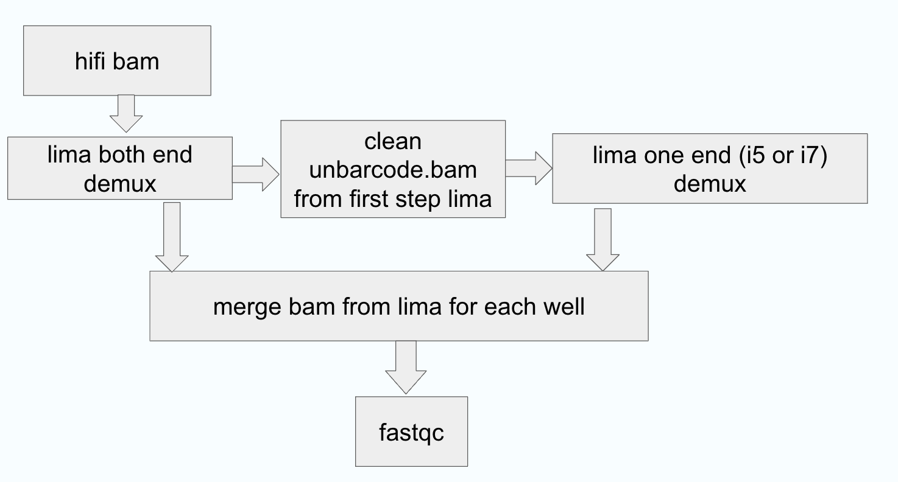

# seqWell LongPlex Demultiplex Nextflow Pipeline
TODO List:

- [X] Get to data output parity with clean repo
- [X] Get invalid outputs for nf-schema recognized correctly
- [ ] Make Sample sheet Latch compliant
- [ ] Put test data on Latch so Latch can use it
- [ ] Cleanup config resource directives? What does latch need.
- [ ] Create integration test with test data
- [ ] Create dev environment
- [X] longplexpy Docker? Currently on docker hub, pulls automatically
- [ ] Single standalone Docker on latch or one per process?
- [ ] Re-write README based on new changes/structure

This is the nextflow pipeline to demultiplex PacBio data for the seqWell LongPlex Long Fragment Multiplexing kit.
The pipeline uses Lima for demultiplex and uses longplexpy tools for data filtering.
The workflow is as shown in the image below.
The workflow starts with hifi bam file(s), then a two-step Lima process is conducted. Each Lima process will clip off the corresponding barcode.

 - The first Lima demulitplex uses the neighbor option to get reads with both i7 and i5 seqWell barcodes. Unbarcoded reads are then used in the next clean and Lima process.
 - From the unbarcoded reads from the first Lima process, longplexpy tool is used to remove undesired hybrids.
 - The second Lima demultiplex process uses i7 OR i5 barcode on the cleaned unbarcoded reads. 

After the two-step Lima process, bam files from these two steps are merged from each sample, and fastq files are also created for each sample from the merged bam files. 
The output from this pipeline has Lima output, demultiplex summary, and a fastqc report for the merged bams for each sample.



## Docker containers used in this pipeline:
 - *lima*: quay.io/biocontainers/lima:2.7.1--h9ee0642_0
 - *samtools*: quay.io/biocontainers/samtools:1.19.2--h50ea8bc_1
 - *longplexpy*: seqwell/longplexpy:latest
 - *R*: rocker/verse:4.3.1
 - *fastqc*: quay.io/biocontainers/fastqc:0.12.1--hdfd78af_0
 - *multiqc*: quay.io/biocontainers/multiqc:1.21--pyhdfd78af_0

## How to run the pipeline:
...

The pipeline can be run using the included test data with:

```
nextflow run \
    -profile docker \
    main.nf \
    -c nextflow.config \
    --samplesheet tests/samplesheet.csv \
    --output ${PWD}/test_output \
    -with-report \
    -with-trace \
    -resume
```

The required inputs are *samplesheet* and *output*.

## samplesheet requirement: 
The samplesheet is in csv format. There are four columns for the samplesheet: sample_ID, sample_path, i7_barcode, and i5_barcode.

 - *sample_ID*: You can have only letters and numbers in sample_ID.
 Please avoid having underline(_) and dash (-) and dot(.) in the sample_ID.
 - *sample_path*: The sample_path can be local or a link to s3 bucket.
 If it is a link to s3 bucket, please make sure to fill in the correct credentials in the nextflow.config file.
 - *i7_barcode, i5_barcode*: The barcodes are in the barcode folder.
 For early access users, please use barcode set3.
 Please use barcode set1 if you bought the kits after the launch.

## output requirement:
The output can be local (an absolute path or a relative path) or a link to s3 bucket.
If it is a link to s3 bucket, please make sure to fill in the correct credentials in the nextflow.config file.

## profile options: 
 - apptainer
 - aws
 - docker
 - singularity
   
Profile option can be changed in the *nextflow.sh* file.

## output from example run:
 - you can find the demultiplex summary in the demux_summary folder.
 - check the README file in the output folder for the output structure.

