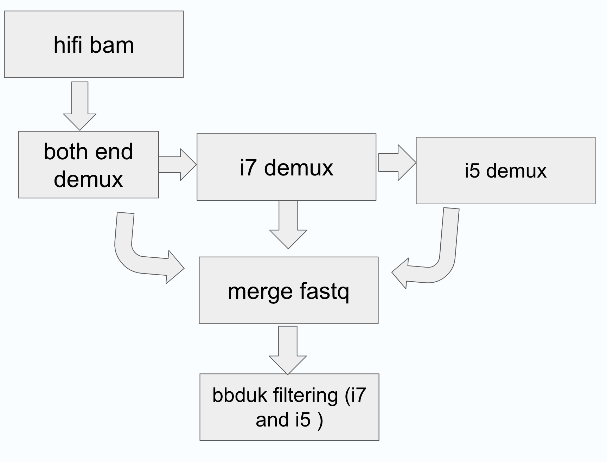

# seqWell longPlex kit demultiplex nextflow pipeline

This is the work flow in nextflow to do demultiplex on pacbio data for seqWell longplex kit. The pipeline uses lima for demultiplex and uses BBDuk for data filtering.  The workflow is as shown in the image below. The workflow starts with hifi bam file, then a three-step lima process is conducted. Each lima process will clip off the corresponding barcode. 
 - lima demulitplex using neighbor option, get reads with both i7 and i5 seqWell barcode. Keep unbarcoded reads which goes to the next lima process.
 - lima demultiplex using i7 barcode on the unbarcoded reads from the previous lima process. Keep unbarcoded reads which goes to the next lima process.
 - lima demultiplex using i5 barcode on the unbarcoded reads from the previous lima process.

After the three-step lima process, bam files from these three stpes are merged from each sample and converted to fastq format. BBduk is used to filter out reads that have extra barcode left on the merged fastq files.
The output from this pipeline has lima output, BBduk output, and also a demultiplex summary from lima and BBduk process.



## Hifi bam file name requirements: 
For the hifi bam file name, it requires pacbio barcode info (for example bc1003) in the third string separated by .
For example, `SEQW102-002-01.hifi_reads.bc1003.bam` is an acceptable bam file name. `bc1003` is used as a key for this hifi bam file in the pipeline. If you have bam file name different from this pattern, please rename the file as the code is using the pattern to create lima produced files. 

## Docker containers used in this pipeline:
 - *lima*: quay.io/biocontainers/lima:2.7.1--h9ee0642_0
 - *samtools*: quay.io/biocontainers/samtools:1.19.2--h50ea8bc_1
 - *bbtools*: staphb/bbtools:39.01
 - *R*: rocker/verse:4.3.1


## How to run the pipeline:
Download the code files and put the files in your working directory like this tree structure. Use `chmod +x bin/*` to make create_bbduk_summary.R executable.

```
$ tree
.
├── README.md
├── nextflow-pacbio-demux-bbduk
│   ├── bin
│   │   └── create_bbduk_summary.R
│   ├── nextflow.config
│   └── pacbio_demux_bbduk.nf
└── nextflow.sh
```
The pipeline can be run using the scripts in the nextflow.sh script, run as `bash nextflow.sh`.
The required inputs are hifi bam files, and seqWell LongPlex barcode. The seqWell barcodes are in the barcodes folder. For early access users, please use barcode set3. Please use barcode set1 if you bought the kits after the launch.

```
#!/bin/bash


samples=*.bam
barcodes_i7=LongPlex_set3_i7_trimmed_adapters.fa
barcodes_i5=LongPlex_set3_i5_trimmed_adapters.fa

nextflow run \
nextflow-pacbio-demux-bbduk/pacbio_demux_bbduk.nf \
-c nextflow-pacbio-demux-bbduk/nextflow.config \
--samples $samples \
--barcodes_i7 $barcodes_i7 \
--barcodes_i5 $barcodes_i5 \
-bg -resume


```


