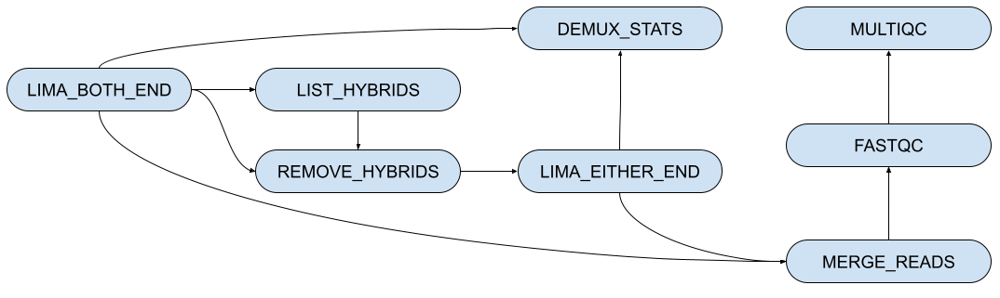

# seqWell LongPlex Demultiplex Nextflow Pipeline

[](https://github.com/seqwell/LongPlex/actions/workflows/nextflow-tests.yml?query=branch%3Amain)
[](https://www.nextflow.io/)

This is the Nextflow pipeline to demultiplex PacBio HiFi data for the seqWell LongPlex Long Fragment Multiplexing Kit.
The pipeline uses [Lima](https://lima.how/) for demultiplexing and uses [longplexpy](https://github.com/seqwell/longplexpy) tools for data filtering.
The pipeline is as shown in the image below.
The pipeline starts with HiFi BAM files and has the following steps:

1. The first Lima process, `LIMA_BOTH_END`, demultiplexes reads using lima's neighbor option.
   This setting will demultiplex reads with both an i7 and i5 seqWell barcode sequence.
2. The `LIST_HYBRIDS` and `REMOVE_HYBRIDS` processes identify and remove any reads with mismatched i7 and i5 seqWell barcode sequences in the remaining non-demultiplexed reads.
3. The second Lima process, `LIMA_EITHER_END`, demultiplexes reads with only an i7 or i5 seqWell barcode sequence.
4. The BAM files for each sample within each pool are merged in the `MERGE_READS` process and FASTQ files are created.
5. The `DEMUX_STATS` process generates a summary of the demultiplexing steps.
6. `FASTQC` and `MULTIQC` are used to generate summary metrics for the reads assigned to each sample in the pool.

The final output from this pipeline includes Lima output files, demultiplexed BAM and FASTQ files, a demultiplexing summary, and a multiqc report collating FASTQC results.



## Dependencies

This pipeline requires installation of [Nextflow](https://www.nextflow.io/docs/latest/install.html).
It also requires installation of either a containerization platform such as [Docker](https://docs.docker.com/engine/install/) or a package manager such as [conda/mamba](https://mamba.readthedocs.io/en/latest/installation/mamba-installation.html).

## Docker Containers

All docker containers used in this pipeline are publicly available.

- *lima*: quay.io/biocontainers/lima:2.13.0--h9ee0642_0
- *samtools*: quay.io/biocontainers/samtools:1.19.2--h50ea8bc_1
- *longplexpy*: seqwell/longplexpy:latest
- *R*: rocker/verse:4.3.1
- *fastqc*: quay.io/biocontainers/fastqc:0.12.1--hdfd78af_0
- *multiqc*: quay.io/biocontainers/multiqc:1.21--pyhdfd78af_0

## Conda Environment

The conda environment is defined in `environment-pipeline.yml` and will be built automatically if the pipeline is run with `-profile conda`.

# How to run the pipeline:

## Required Parameters

The required parameters are *pool_sheet* and *output*.

### `pool_sheet`

`pool_sheet` is the path to a CSV file.

There are four required columns:

- *pool_ID*: Identifier to be used in naming output files.
  Must contain only letters and numbers in `pool_ID`.
  Please avoid having underscore (`_`), dash (`-`), and dot(`.`) characters in the `pool_ID`.
- *pool_path*: Path to PacBio HiFi BAM file for this pool.
  This path can be a local absolute path or an AWS S3 URI.
  If it is an AWS S3 URI, please make sure to [set your security credentials appropriately](https://www.nextflow.io/docs/latest/amazons3.html#security-credentials).
- *i7_barcode* and *i5_barcode*: Path to the appropriate barcodes in FASTA format.
  Default barcodes are found in `barcodes/`.
  For early access users, please use barcode set labelled `set3`.
  Please use barcode set labelled `set1` if you bought kits after product launch.

### `output`

The output directory path can be a local absolute path or an AWS S3 URI.
If it is an AWS S3 URI, please make sure to [set your security credentials appropriately](https://www.nextflow.io/docs/latest/amazons3.html#security-credentials).

## Profiles:

Several profiles are available and can be selected with the `-profile` option at the command line.

- `apptainer`
- `aws`
- `conda`
- `docker`
- `singularity`

## Example Command

A minimal execution might look like:

```bash
nextflow run \
    -profile docker \
    main.nf \
    --pool_sheet "${PWD}/path/to/pool_sheet.csv" \
    --output "${PWD}/path/to/output"
```

# Running Test Data

## With Docker

The pipeline can be run using included test data with:

```bash
nextflow run \
    -profile docker \
    main.nf \
    -c nextflow.config \
    --pool_sheet "${PWD}/tests/pool_sheet.csv" \
    --output "${PWD}/test_output" \
    -with-report \
    -with-trace \
    -resume
```

## With Conda

```bash
nextflow run \
    -profile conda \
    main.nf \
    -c nextflow.config \
    --pool_sheet "${PWD}/tests/pool_sheet.csv" \
    --output "${PWD}/test_output" \
    -with-report \
    -with-trace \
    -resume
```

## Expected Outputs

```console
test_output/
├── bc1015/
│   ├── demux_summary/
│   │   └── bc1015_demux_report.csv                          # Summary of demultiplexing results
│   ├── hybrids/
│   │   ├── bc1015.hybrid_list.txt                           # List of reads with mismatched i5 & i7 barcode sequences
│   │   └── bc1015.unbarcoded.filtered.bam                   # Reads that did not demultiplex in step LIMA_BOTH_ENDS with hybrid reads removed
│   ├── lima_out/
│   │   ├── demux_either_i7_i5/                              # Demultiplexing results using a single barcode
│   │   │   ├── bc1015.[BARCODE_ID]--[BARCODE_ID].bam        # Reads demultiplexed based on a single barcode
│   │   │   ├── ...
│   │   │   ├── bc1015.unbarcoded.bam                        # Reads that failed to demultiplex
│   │   │   ├── i7_5_bc1015.lima.counts                      # Counts of each observed barcode
│   │   │   └── i7_5_bc1015.lima.summary                     # Summary of lima read filtering results
│   │   └── demux_i7_i5/                                     # Demultiplexing results using i5 and i7 sequences
│   │       ├── bc1015.lima.report                           # lima findings for every read
│   │       ├── bc1015.[P5_BARCODE_ID]--[P7_BARCODE_ID].bam  # Reads demultiplexed based on matching i5 and i7 sequences
│   │       ├── ...
│   │       ├── bc1015.unbarcoded.bam                        # Reads that did not demultiplex in the first lima process
│   │       ├── i7_i5_bc1015.lima.counts                     # Counts of each observed barcode
│   │       └── i7_i5_bc1015.lima.summary                    # Summary of lima read filtering results
│   ├── merged_bam/
│   │   ├── bc1015.[BARCODE_WELL].bam                        # Merged BAM file for specific barcode well
│   │   └── ...
│   └── merged_fastq/
│       ├── bc1015.[BARCODE_WELL].fastq.gz                   # Merged FASTQ file for specific barcode well
│       └── ...
├── logs/
│   ├── execution_report_[DATE-TIME-STAMP].html              # Nextflow execution report
│   ├── execution_timeline_[DATE-TIME-STAMP].html            # Nextflow execution timeline
│   ├── execution_trace_[DATE-TIME-STAMP].txt                # Nextflow execution trace
│   └── pipeline_dag_[DATE-TIME-STAMP].html                  # Nextflow pipeline DAG
└── multiqc/
    └── [DATE-TIME-STAMP]_multiqc_report.html                # MultiQC report including FASTQC results
```
